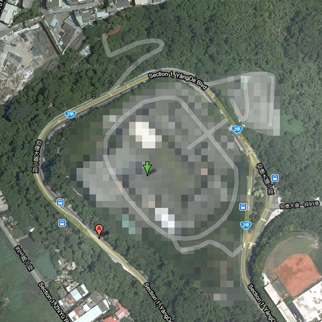
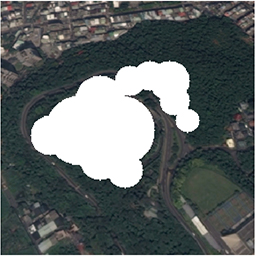
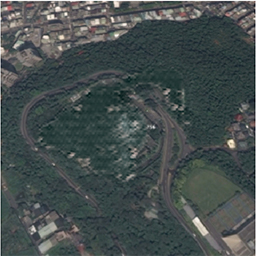

# Neural Camouflage

## Introduction

Google Earth made sophisticated satellite images accessible to anyone with a digital device and internet connection. However, sensitive locations, which used to be well hidden from the public, were fully exposed. Thus, easy access to satellite images poses a potential threat to national security and privacy.

On the one hand, it is necessary to completely hide details in secret facilities. Usually those locations are censored with single-color or pixelation patches which do not blend in with surrounding structures. On the other hand, such "cover-ups" often raise people's curiosity and attract more public attention.



To tackle this delimma, I applied the technology of photo retouching to satellite images where the sensity structures were replaced by textures mimicing the surrounding structures. This process was automated using a dense [partial convolutional](https://arxiv.org/pdf/1804.07723.pdf) neural network.





# My Model

The architecture is a modified version of [UNet](https://arxiv.org/pdf/1505.04597.pdf) where the encoding convolutional layers are replaced by partial convolutional layers together with partial batch normalization. The partial convolution layer takes (i) an image (or its feature map) with a hole, and (ii) the mask indicate the location of the hole; the output is a partial convolution feature map skipping the hole region and the mask for the remaing hole in the feature map.

## Partial Convolution Layer

```python
class PartialConv2d(in_channels, out_channels, kernel_size, stride=1, padding=0, dilation=1, groups=1, bias=True, device=device)
```

### Parameters:

- **in_channels** ([*int*](https://docs.python.org/3/library/functions.html#int)) – Number of channels in the input image
- **out_channels** ([*int*](https://docs.python.org/3/library/functions.html#int)) – Number of channels produced by the convolution
- **kernel_size** ([*int*](https://docs.python.org/3/library/functions.html#int) *or* [*tuple*](https://docs.python.org/3/library/stdtypes.html#tuple)) – Size of the convolving kernel
- **stride** ([*int*](https://docs.python.org/3/library/functions.html#int) *or* [*tuple*](https://docs.python.org/3/library/stdtypes.html#tuple)*,* *optional*) – Stride of the convolution. Default: 1
- **padding** ([*int*](https://docs.python.org/3/library/functions.html#int) *or* [*tuple*](https://docs.python.org/3/library/stdtypes.html#tuple)*,* *optional*) – Zero-padding added to both sides of the input. Default: 0
- **dilation** ([*int*](https://docs.python.org/3/library/functions.html#int) *or* [*tuple*](https://docs.python.org/3/library/stdtypes.html#tuple)*,* *optional*) – Spacing between kernel elements. Default: 1
- **groups** ([*int*](https://docs.python.org/3/library/functions.html#int)*,* *optional*) – Number of blocked connections from input channels to output channels. Default: 1
- **bias** ([*bool*](https://docs.python.org/3/library/functions.html#bool)*,* *optional*) – If `True`, adds a learnable bias to the output. Default: `True`
- **device** ([*class* `torch.device`](https://pytorch.org/docs/stable/tensor_attributes.html?highlight=device#torch.torch.device), *optional*) The device on which the mask tensor will be allocated. Default: `device = torch.device("cuda" if torch.cuda.is_available() else "cpu")`

### Shape:

- **Input**: image `(batch, in_channel, height, width)` and mask `(1, 1, height, width)`
- **Output**: feature map `(batch, out_channel, new_height, new_width)` and mask `(1, 1, new_height, new_width)`

### Variables:

- **weight** ([*Tensor*](https://pytorch.org/docs/stable/tensors.html#torch.Tensor)) – the learnable weights of the module of shape (out_channels, in_channels, kernel_size[0], kernel_size[1])
- **bias** ([*Tensor*](https://pytorch.org/docs/stable/tensors.html#torch.Tensor)) – the learnable bias of the module of shape (out_channels

## Partial Convolution Block

```python
class PConvBlock(in_channel, out_channel, conv_para, pool_para)
```

The input image and mask are passed to partial convolution and then partial batch normalization (avoiding the hole region).  The output feature map is then passed to a `ReLU` layer and `MaxPool2d` layer; the mask is downsampled with the same `MaxPool2d` layer.

### Parameters:

- **in_channels** ([*int*](https://docs.python.org/3/library/functions.html#int)) – Number of channels in the input image
- **out_channels** ([*int*](https://docs.python.org/3/library/functions.html#int)) – Number of channels produced by the convolution
- **conv_para** ([*dict*](https://docs.python.org/3/library/stdtypes.html#mapping-types-dict)) – Parameters of partial convolution layer
- **pool_para** ([*dict*](https://docs.python.org/3/library/stdtypes.html#mapping-types-dict)) – Paramters of max-pooling layer, see [*class* `torch.nn.MaxPool2d`](https://pytorch.org/docs/stable/nn.html#torch.nn.MaxPool2d)

### Shape:

- **Input**: image `(batch, in_channel, height, width)` and mask`(1, 1, height, width)`
- **Output**: feature map `(batch, out_channel, new_height, new_width)` and mask `(1, 1, new_height, new_width)`

### Variables:

- **weight** ([*Tensor*](https://pytorch.org/docs/stable/tensors.html#torch.Tensor)) – the learnable weights of the module of shape (out_channels, in_channels, kernel_size[0], kernel_size[1])
- **bias** ([*Tensor*](https://pytorch.org/docs/stable/tensors.html#torch.Tensor)) – the learnable bias of the module of shape (out_channels)

```python
class PConvNet(n_hidden=8)
```

There are 8 partial convolution blocks `PConvBlock` downsampling the images, and 8 transposed convolution blocks reconstructing the images. Each transposed convolution is composed of the following:

- `torch.nn.ConvTransposed2d` functions as reverse of `torch.nn.MaxPool` in the mirroring partial convolution block.
- `torch.nn.BatchNorm2d` 2D Batch Normalization
- `torch.nn.ConvTransposed2d` functions as reverse of `PartialConv2d`
- `torch.nn.ReLU` ReLU layer
- Concatinate the feature maps of the mirroring `PConvBlock` to the output of ReLU layer
- Compress the concatinated feature maps using 1x1 convolution `torch.nn.Conv2d`

### Shape:

- **Input**: image `(batch, in_channel, height, width)` and mask`(1, 1, height, width)`
- **Output**: image `(batch, in_channel, height, width)`